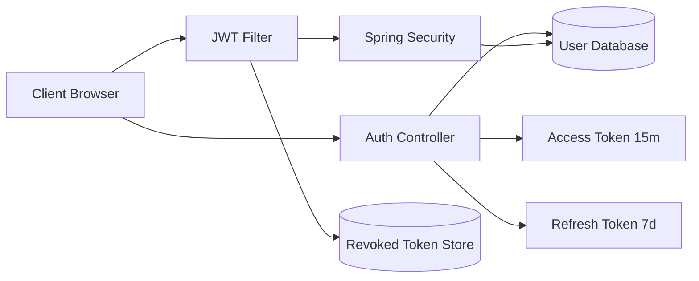
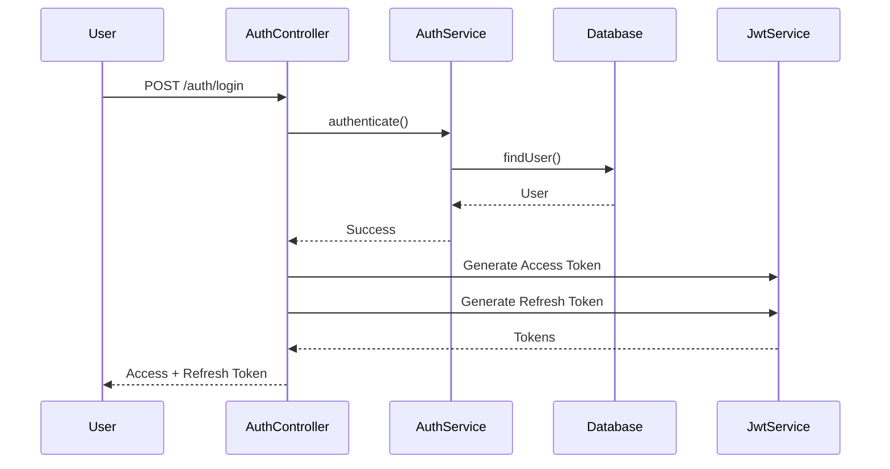
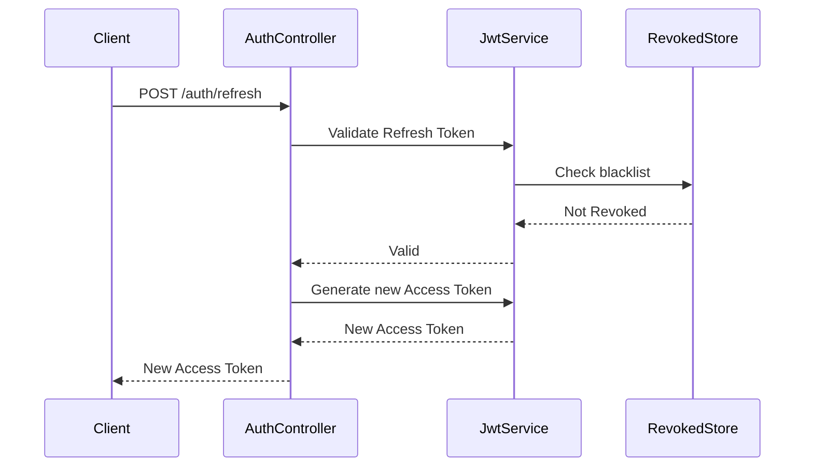
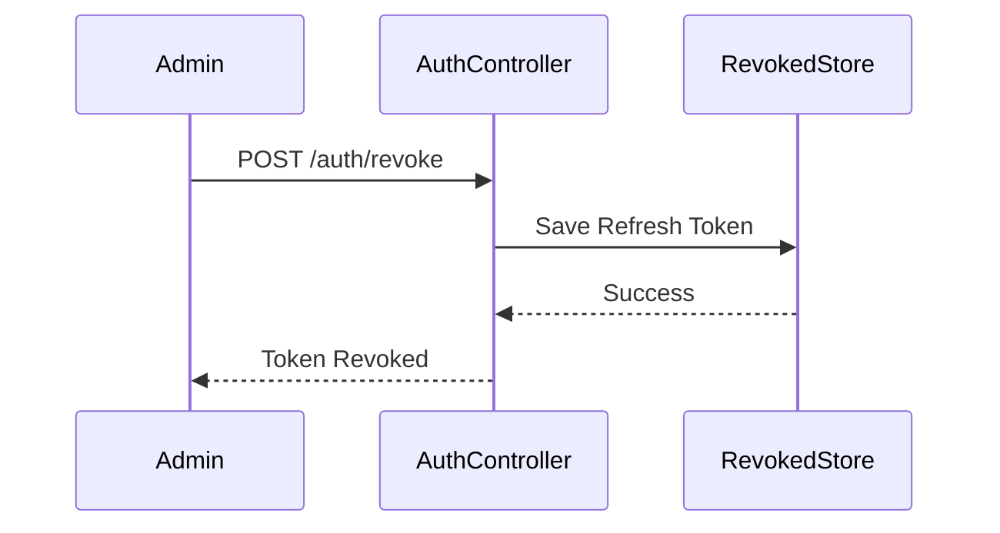
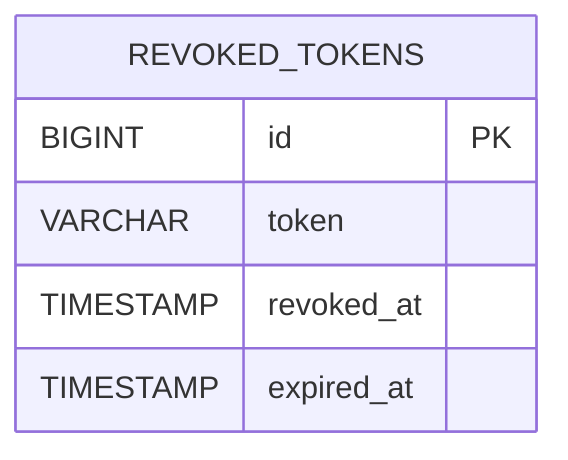
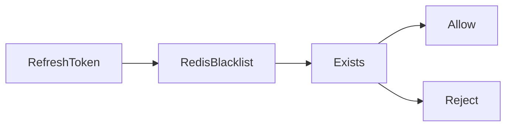
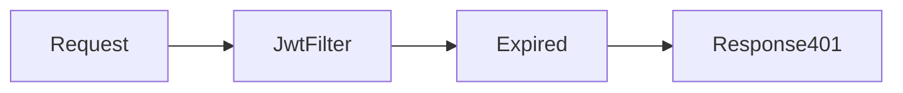
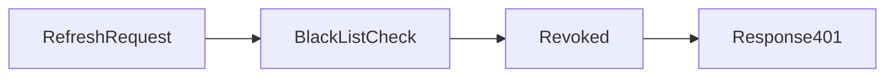
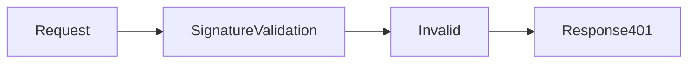

# PHẦN 1 - THIẾT KẾ KIẾN TRÚC

## 1. Kiến trúc tổng thể




# 2. Kịch bản Login

## Mục tiêu

Người dùng đăng nhập thành công và nhận:

- Access Token (15 phút)
- Refresh Token (7 ngày)

## Sequence Diagram



---

# 3. Kịch bản Refresh Token

## Mục tiêu

Tự động cấp Access Token mới mà không cần đăng nhập lại.

## Sequence Diagram



---

# 4. Kịch bản Revoke Token

## Mục tiêu

Thu hồi hoàn toàn quyền truy cập của người dùng.

## Sequence Diagram



---

# 5. Chiến lược lưu trữ Revoke

## Phương án sử dụng Database



### Ưu điểm

- Dễ triển khai
- Dễ audit
- Dễ backup

### Nhược điểm

- Chậm hơn Redis

---

## Phương án sử dụng Redis



### Ưu điểm

- Tốc độ O(1)
- Phù hợp hệ thống lớn

### Nhược điểm

- Cần thêm Redis Server

---

# 6. Xử lý Edge Cases

## Access Token hết hạn



Response:

```json
{
  "message":"Access Token expired"
}
```

---

## Refresh Token bị Revoke



Response:

```json
{
  "message":"Refresh Token revoked"
}
```

---

## Token giả mạo



Response:

```json
{
  "message":"Invalid token signature"
}
```